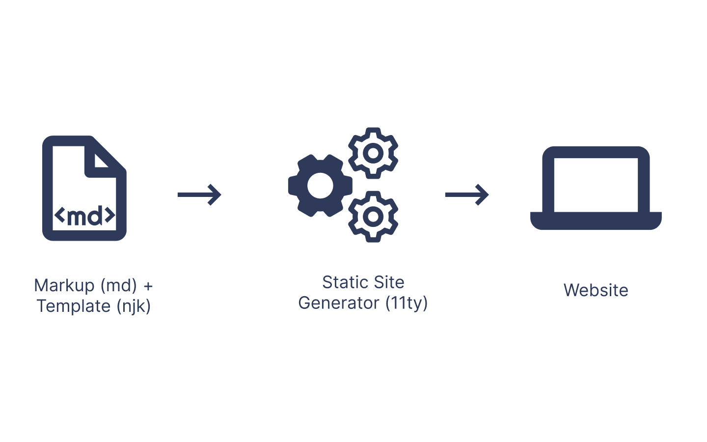

What a year we must say... When we were talking in December 2019 about this little flu coming from China, nobody knew that would become an apocalypse in the modern world. But as I'm not a specialist on the geopolitical situation nor medicinal stuff, I'm going to talk to you about my year.

## A new job

Well, I’m glad to say I’ve spent this whole 2020 within [Heetch](https://www.heetch.com/fr). Maybe the best company I’ve ever worked with. Even if the year was rough for the ride-hailing business, I must say the direction made all the efforts to make us go through all the different challenges we’d face.

Even if the office is not far from my home, I’ve spent almost all year working remotely and I’ve discovered that I was more than pleased to [work in this situation](https://julien-brionne.fr/posts/working-remotely-as-a-team/). My year was spent on multiple projects I’ll certainly share more in detail in 2021. Focused on the customer care domain, we’ve touched on elements like trust, safety, FAQ, feedbacks.

3 main projects have been touched during this year :

- Revamping all the Heetch Admin
- Removing 5-Star-ratings system and enhancing feedback experience
- Building the B2B offer

## A new website

At the beginning of 2020, I decided to go back on Front-End and decided to play with Sketch, Photoshop, and recently Figma. After 10 years of rebuilding a version of my site without releasing it, I’ve finally succeeded in building one that I like.

If you’re interested in how it’s done, well you can check the source on [Github](https://github.com/Akashrine/jbr-11ty).

Everything’s based on an SSG ^[A **static site generator** is a software application that creates HTML pages from templates or components and a given content source.] called [Eleventy](https://www.11ty.dev/), templating is done in Nunjuck, style is in SCSS, and some javascript here and there. There’s no CMS behind it even if I’d like to try [stapi](https://strapi.io/) as a headless CMS.

So what’s the idea behind a static site generator?

<figure class="extent">
    
    <figcaption>SSG workflow</figcaption>
</figure>

My writing workflow looks like this :

- Writing article in markdown with [Typora](https://typora.io/)
- Generating post in Eleventy
- Git push
- Netlify magic
- Voilà!

It was a challenge to keep my motivation up after finishing the design and the code.

## Side Projects

Being a dad, having a lot of hobbies don’t leave me with a lot of extra times but when I find some I usually try to do everything in a row, It’s hard for me to go to bed early and it’s making me anxious to go to bed without “creating” something. So usually I end up doing some small code project, or some unnecessary design or create some music I’m not finishing.

2020 being over, 2021 will be about having in mind a project for every stuff I’d like to experiment with. So here’s what I’d like to do :

Combining music and design :

- Creating a soundtrack for a false movie
- Creating the poster for this same false movie

Code + Design + Music :

- Create a small web app listing all your favorite artists with their most listened music and trying to link some third parties to access lyrics etc …

Design

- I’m trying to enhance my knowledge of the amazing free tool Figma by doing an infographic on my musical taste.

## Family

Even if this year was hard on everyone, that a lot of bad stuff happened, I have some good news on this subject, I’ll be a dad for the second time in May 2021!

