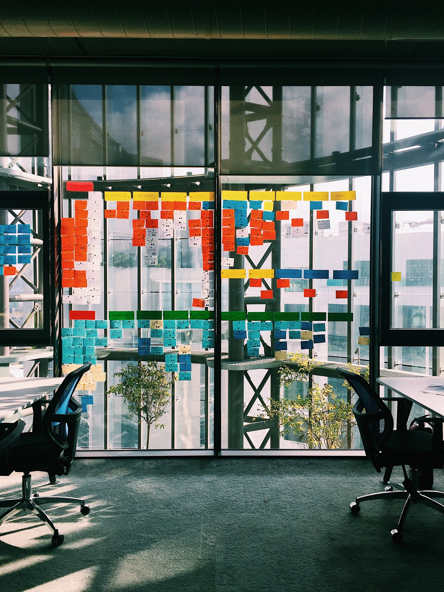

Who will I cheat ? Launching a website is hard, launching <em>your</em> website is worst. Launching it in 2020 when you're already 35 years old, a dad and 2 loans to refund, needless to say we're flirting with insanity. It is not how I planned to start this first article but hey ! here we are 

<<<<<<< HEAD
Alors bien sûr, ce n'est pas mon premier site, ce n'est pas non plus mon premier essai de relancer mon site, pour être précis ce que vous voyez est la V6 et seule la V1 aura vu le jour jusqu'à présent... 

En 2008, j'ai débuté mon activité de freelance en tant que Webdesign / Intégrateur avec quasiment aucune expérience professionnel. A l'époque j'avais dans les pattes 2-3 stages à mon actif et beaucoup de temps libres, et naïvement je m'étais dit que je savais gérer des clients, que j'étais prêt à gérer une activité d'entreprenariat avec tout ce que ça implique. Et surtout je me disais, du haut de mes 6 mois d'expérience cumulées et avec les 3 contacts que j'avais que je vivrais du bouche à oreille. La folie de la jeunesse dirons nous... N'empêche que, se lancer dans le vide sans filet c'est une jolie école de la vie, on apprend énormément (à ses dépends). 

Pendant cette période j'avais tout le loisir d'exposer mes premiers travaux personnels, et surtout montrer les 2 ou 3 premiers travaux que j'avais fait pour de vrais clients. Remplir mon portfolio était facile, rapide et appréciable. 

=======
In 2O08, I started my freelance activity as a __webdesigner / integrator__, with almost zero professional experience. At the time I just did one or two internships where I felt like I understood how to operate a client. And I said to myself, from the top of my 6 months accumulated experiences, and with the 3 contacts I had, I could live by word of mouth ...

This leads to today ... 
>>>>>>> parent of d981eff... beginning, english is frightening so back in French

## From webdesigner to Product Management

<figure class="extent">
    
</figure>

So what happened ? 

    Lorem ipsum dolor sit amet, consectetur adipiscing elit. Suspendisse fringilla gravida risus, tincidunt mattis dolor aliquam ut. Praesent orci justo, vestibulum at sem nec, viverra mollis turpis. Morbi consectetur cursus ante. Quisque vehicula massa at maximus dignissim. Quisque efficitur porttitor blandit. Lorem ipsum dolor sit amet, consectetur adipiscing elit. Quisque id ex vitae ipsum lobortis egestas. Duis gravida erat a quam laoreet vehicula. Orci varius natoque penatibus et magnis dis parturient montes, nascetur ridiculus mus.

