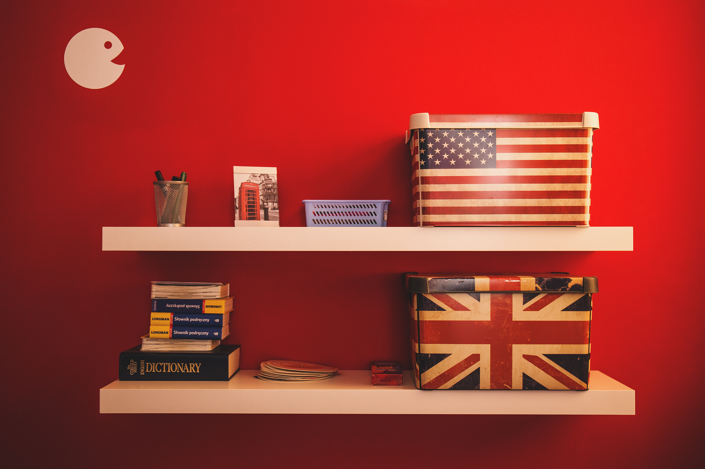

Who am I kidding? Launching a website is hard, launching <em>your</em> website is worse. Launching it in 2020 when you're already 35 years old, a dad and 2 loans to pay off - needless to say we're flirting with insanity. But there are reasons!

## Back online

Okay, this is my first motivation to relaunch my website. It's now been 12 years since the last time I've been "online", everything has changed a lot but that's part of the fun : __Adaptation__ 💪.

The last time I was online it was because I needed it. I was launching my freelance business with less than 6 months of experience and only 2 or 3 "contacts". Needless to say the portfolio was a mandatory element!

Now I'm not a web designer anymore, I've made small changes after small changes to become a [Product Manager](https://linkedin.com/in/julienbrionne). I'll talk about it one day. So the idea is to be back online once again and share my thoughts.

## Experiment with code again

<figure class="extent">
    
    <figcaption>Back to code</figcaption>
</figure>

In order to go back online I had to start coding again and even if it was harder than expected, I had a lot of fun while doing this site. It is obviously not over and we can clearly say that it's more of an <abbr data-tooltip title="Minimum Viable Product">MVP</abbr> than a final version but, as I'd like to go further in development, I'm keeping this site as a great place to experiment (and obviously fail a lot).

<blockquote cite="Roy T. Bennett">
    Do not fear failure but rather fear not trying. 
    <cite>Roy T. Bennett, The Light in the Heart</cite>
</blockquote>

## Writing ... in english

<figure class="extent">
    
    <figcaption>English is my language</figcaption>
</figure>

Even if I'm working in English every day and feeling confident talking in English, when it comes to writing longer posts I lack vocabulary, and I globally suck at using the right tense. As I want to progress, my posts will pass through the critical eyes of a native speaker (👋[Tam](https://github.com/tamarasaurus)).
The second thing about writing in English is expanding the reach of my articles a little more: I obviously don't want to be well known, but if some of my articles can be helpful, let's help more people.

## Kill procrastination



When you have a kid, and when you have a daily job, it's really easy to become less creative/productive during your free time (unless 💤, an activity I've become good at). It's much easier to let the time flow through a good video game, a good show or even worse, a youtube marathon about some obscure subject.

So when the confinement occured, I told myself, no more Twitch, no more YouTube - only a constructive activity (even if it means playing a video game, at least you're making something with a goal.) And thanks to Covid-19 (this is the only case I can say "thank you' to this) I've set myself ready to once again start this website with the whole stack that I wanted to test.

Now the idea is to work on it a little everyday, write words, test code, and share thoughts...
As James Clear, the author of [Atomic Habits](https://www.amazon.fr/dp/0735211299/ref=as_li_qf_asin_il_tl?ie=UTF8&linkCode=gs2&linkId=723bbc2363b811f5d76f4b77a8e2fb87&creativeASIN=0735211299&tag=dariusforou03-21&creative=9325)

<blockquote cite="James Clear">
    A new habit should not feel like a challenge. The actions that follow can be challenging, but the first two minutes should be easy. What you want is a “gateway habit” that naturally leads you down a more productive path. 
    <cite>James Clear, Atomic Habits</cite>
</blockquote>

## So what will I talk about ?

I'll talk about things I know, things I like, things I discover, things I experiment with. So we'll talk about product, music, design and a little about code. I'll talk about my family, about my amazing son 🐯 and his amazing mum ♥.

See you really soon.
