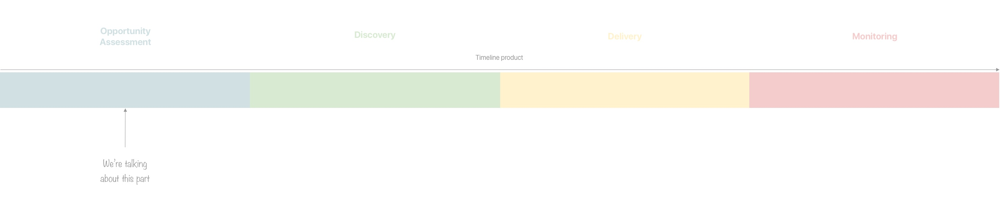

We often hear: A Product Manager must be good at solving problems, find solutions, think in advance about what the product will be, and create amazing features. Well that's not really true. 

## Learn by failing 

When I started being a product manager, I was obsessed with creating things, designing solutions, digging into technical details and finding amazing features for users. I thought I was doing really well... But one day I faced a customer who told me: "These features look really great but I don't need it". That was my first learning. 

<figure class="extent">
    
    <figcaption>Don't be affraid to fail</figcaption>
</figure>

Then, I tried to get more involved in finding problems. I still remember saying to a coworker "Stop thinking about solutions, what is their problem?". But in reality I was kind of lying to myself. <q>Failure is not the opposite of success - it's part of success</q>
Yes I was looking for problems, but it was just a starting point to get back directly to the solution. 

As usual you essentially learn in life by failing, and it is important to succeed your fail.

## Problem oriented VS Solution oriented

<figure class="extent">
    
    <figcaption>problem solving</figcaption>
</figure>

Jumping to a solution, thinking too much about answering the problem or worse, thinking too much about how to implement the solution can be a huge blocker and can make your product move too far away from its true goals.
Simple example: I was talking with a friend and he told me that one of his company's product's last feature was not used. His PM told him:

> - "Well we should communicate more on this feature!"
> - "Ok and so what will make them use it more?" 
> - "They'll be aware of the feature..."

Looks interesting... if you want more people to see the feature, but what about __using it__? 
The real subject is to understand why they don't use is. Worst thing that can happen is digging and finding the feature is not used because no one need it, it doesn't solve __anything__. 

I think a good product manager is able to solve the correct problem before solving the problem correctly. We'll talk about the really important part of "Opportunity Assessment" a.k.a: DESTROY THE PROBLEM 💣

## Managing Problems

<figure class="full-width">
    
    <figcaption>Really simplified product framework process</figcaption> 
</figure>

So what does it mean to manage problems? 
It is about putting aside any assumptions of the problem you think you're solving. Of course you have your own feeling on what's a big issue VS what's a tiny problem, but globally you have stay outside the box. 
What is important to do when facing an issue, is taking a rest. I'm not talking about having a nap, but step aside. WHY? Because our brain has a lot of difficulties to "avoid" solution. When you see a problem you always think about many funky ways to solve it. 

### Define the problem

[__Confirmation bias__](https://en.wikipedia.org/wiki/Confirmation_bias) can occur in a lot of kinds of research, but by using the problem mindset you should reduce the risk to only filter information that only confirms your hypothesis. 
Defining the problem is usually done by answering some questions and by doing an Opportunity Assessment. 

Globally you have to: 

1. Establish the need for a solution:
   1. What is the basic need?
   2. What is the outcome?
   3. Who's our customer target (or Persona)?
2. Define the why:
   1. Is it in the company goal? aligned with your strategy?
   2. What is the company outcome / desire?
3. Set the contextualization of the problem: 
   1. What competitors have tried?
   2. What have you already tried (if you did)?
   3. What are the impacts, the constraints?
4. Write down the final statement of the problem:
   1. Is it only ONE problem?
   2. What are the requirements?
   3. What are the key metrics we want to measure?
   4. How do you measure the success of the metrics?
   5. Define goals / Define non-goals

You should have a better understanding of your problem and as you can see, we haven't yet touch the How. Now it's a matter of __breaking down__ the problem. 

### Breakdown the problem in issues

I usually say: one problem at the time. It is the same as factorization in mathematics. The idea is to obtain smaller and more precise problems from the big problem. There are many methodologies to do this: 

* [fishbone](https://tallyfy.com/definition-fishbone-diagram/)
* [5 why](https://www.mindtools.com/pages/article/newTMC_5W.htm)
* [Lean Canvas](https://leanstack.com/leancanvas) 

All of this helps you find your root/core problem(s) and its baby brothers.

It's important to break down an issue into smaller parts for 3 reasons:
1. Parallelisation of dev
2. To ease defining a MVP (minimum viable product) or a more fancy RAT (Riskiest Assumption and Test)
3. Easier to go deeper into your main problem by digging into every small aspect of it

### Prioritize the issues

I'll write a separate article on __prioritization__ because it is a deep subject. There are several types of prioritization along the Product Process: Insights Prioritization, Prioritization between projects, Prioritization within projects. 
Here I'm not talking about prioritizing all your problems but prioritizing the issues you've split from the problem we're breaking down. 

There's once again a lot of methodology about prioritizing: 

* Use of matrix 
* [RICE](https://www.intercom.com/blog/rice-simple-prioritization-for-product-managers/) (Reach, Impact, Confidence, Effot)
* [SIEVE Checklist](https://engineering.brigad.co/how-we-prioritize-features-at-brigad-the-sieve-checklist-de8c2b18d12a)
* [Priority Scorecard](https://danielelizalde.com/product_management_scorecard/) (custom criteria)

Once all of this over, you're done with __Opportunity Assessment__. 

## Then Solution: the winning tryptic 

In order to find good solutions to the well defined problem, you can't be alone.
I have the chance to work in a [company](https://heetch.com) where I'm surrounded by amazing colleagues with the right roles and missions:
* An [Engineering Manager](https://twitter.com/DavidGuyon) (EM)
* A [Product Designer](https://www.linkedin.com/in/elodiemermet/) (PD) 

I'll write another article (that makes a lot to write 😃) on this but globally here's how we work: 

__Product Manager__ : Digging into problems, cracking them, prioritizing, defining... I'm about where do we go, why, when, and for what results. Challenging and helping the Product Designer on the solution.

__Product Designer__: Cracking problems into solutions, designing, iterating, testing, interviewing users, user research ...   

__Engineering Manager__: Discovery + Delivery, how to do the solution, define technical risk, challenge solution, define effort, think about scale, manage amazing developers. 

Thanks a lot for all of you who reached the end of this first article. 