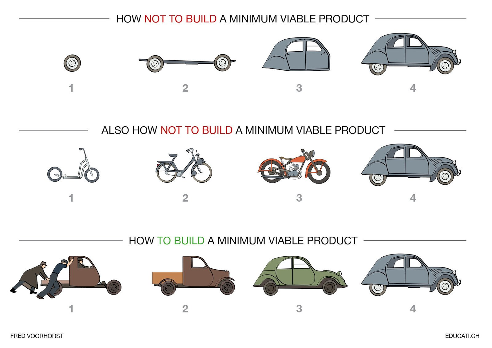
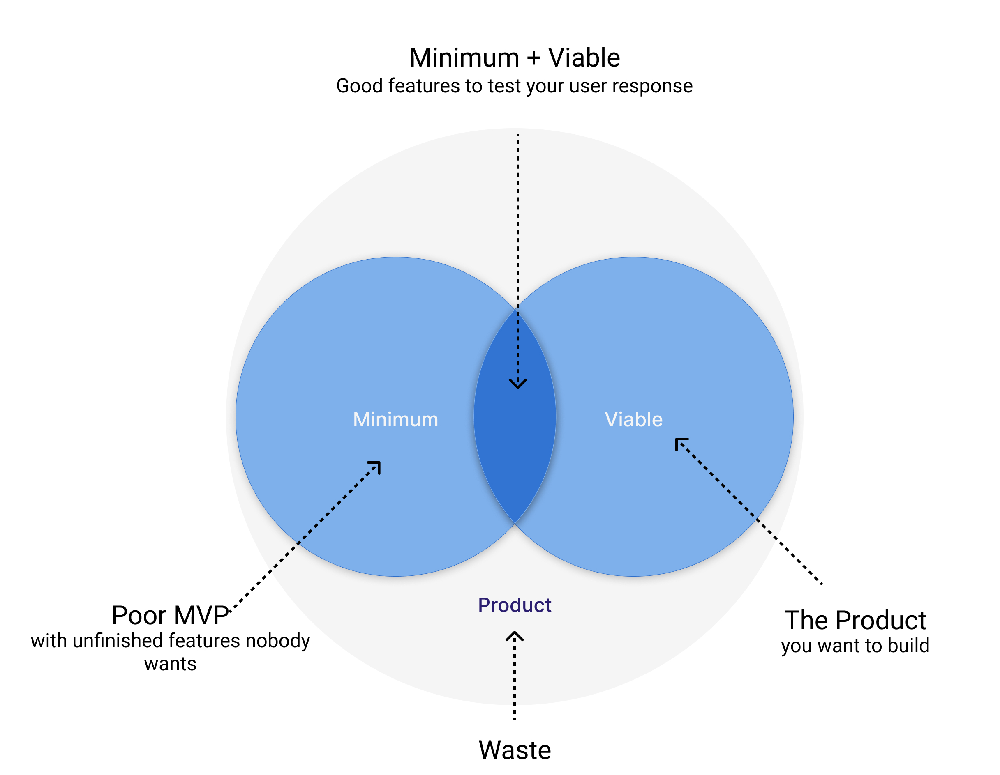
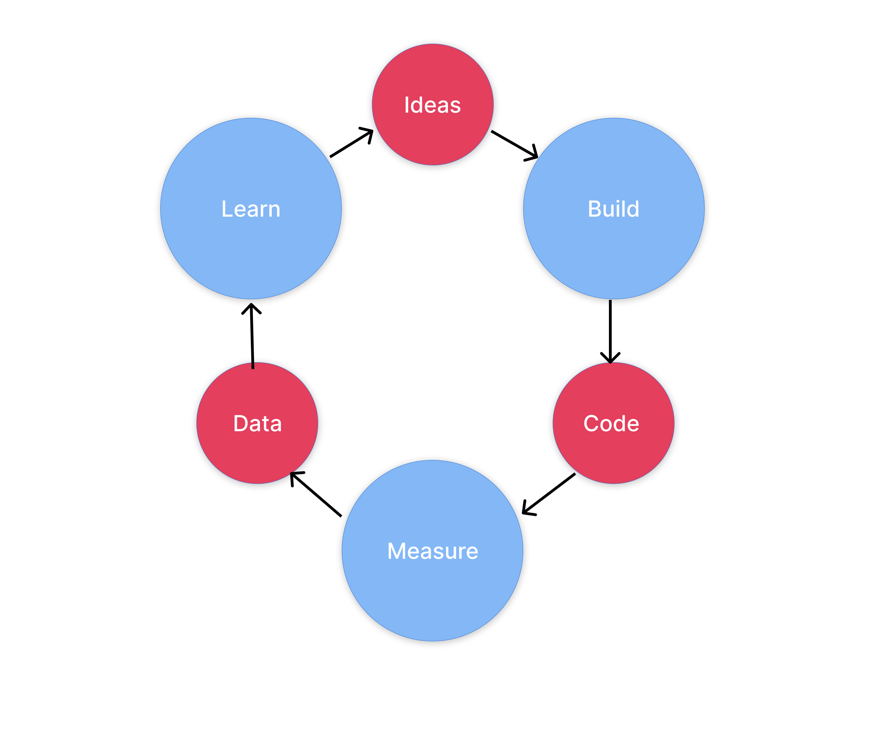

   It is quite common nowadays, to hear about doing an MVP when you're in the wonderful world of product or in a startup. The term is often used as a keyword to say "we want to go live ASAP". Unfortunately, an MVP is usually badly used or worst badly done. As everyone uses the acronym MVP without really knowing what's behind it, we come up with new fancy acronyms: MLP, MMP, RAT, SLC... But in the end, we're talking about MVP. 

## MVP? What are we talking about?

Before going further, what is an MVP? An MVP is often attached to one of the most important techniques in a lean startup. The minimum viable product is the version of a new product which allows a team to collect the maximum amount of validated learnings about customers with the least effort. (Nice one no ?).

<blockquote cite="Marty Cagan">
    I have long defined minimum viable product as the smallest possible product that has three critical characteristics: people choose to use it or buy it; people can figure out how to use it; and we can deliver it when we need it with the resources available – also known as valuable, usable and feasible. 
    <cite>Marty Cagan, <a href="https://svpg.com/minimum-viable-product/">Minimum Viable Product</a></cite>
</blockquote>

Now what’s complicated is that even if defining it is quite “easy”, understanding it and doing it is much harder.
Pro-MVPs say that building the smallest amount will help you find out what features your users really want, ensuring that you only build the right ones. Anti-MVPs will tell us that a MVP is just an unfinished product that no one will love and that will stay in this state forever.

As a reminder, a MVP is usually about this : 
* __Learning__: You're here to validate ideas: What are we trying to learn?
* __Iterate__: Your MVP will evolve quickly after each learning
* __Viable__: Why is everyone forgetting that the V in MVP is viable. It is nice to be fast, but if it's crap ...
* __Minimum__: One of the hardest parts, you have to come with the least number of features in order to stay reliable. 

MVP is built on a serie of iterations that we call "build-measure-learn". 

<figure class="extent">
    
    <figcaption>Iterate through MVP</figcaption>
</figure>



__top line__: The misconception about iterative and incremental development. It usually is one of the main reasons for a product to fail. It focuses on the components more than on the problem to be solved. While going closer and closer to the actual user needs. It will last 4 iterations before delivering the actual solution. And before that, your user isn’t provided with a viable solution, nor can he provide feedbacks to help evolve your product. While being a way to do product, and while being agile, you don’t allow helpful feedback from your end-user.

__middle line__: Usually the metaphor stops here by saying: you should do this. Well, this solution is focused on the problem (going from A to B) and provides a chosen solution every iteration. This solution allows you to validate, and invalidate your hypotheses, to quickly develop a prototype or a proof of concept.
Proof of concept is interesting to demonstrate an idea, a product, a service or to verify feasibility. However, it does not answer the question: “Is this thing valuable for a user”. If you deliver a skateboard, does it solve your user's real need and problem? Not really. Is it valuable, usable, and a feasible solution. No. Every iteration looks like a new product and not an evolution. While this approach allows for user testing, feedback, and refinement of the solution, it doesn’t address the fact that our user needs a __car__.

__last line__: This is how you do an MVP. From iteration 1 to iteration 4 you meet the needs of your end-user. Each iteration is an evolution of the previous one. The solution is viable, feasible, and usable. More than this, you can “feel” the business model and the strategy behind the product, not just an idea to solve a problem.

## New acronyms

As people weren’t convinced by the efficiency of this 3 letters (Viable is the hardest one to be understandable), they come with a lot of fancy new acronyms to help redefine what should be an MVP such as :

__MLP__ (Minimum Lovable Product): The idea is to make your product instantly lovable by people, meaning you’re playing on an emotional level. As opposed to the MVP you're launching your most important features first, not the primordial one. It’s usually used when facing an already competitive environment. And it “usually” comes after your MVP.

__RAT__ (Riskiest Assumption Test): Test directly your most dangerous assumption. Once again it's about build, mesure and learn but more in this order : 
* Learn
* Measure
* Build fast

__SLC__ (Simple, Lovable, Complete): This one’s more subtle. It’s like an MVP but with a strong emphasis on “Simple” opposed as minimum. The minimum variable is often seen as " we want to ship at this date, what do we cut, what features won’t make it". Simple is more about, these features are nice, but can we simplify them. The great thing about Simplicity is that it can be part of the conversation from the very beginning.

__MMP__ (Minimum marketable product) : To be simple, it's an MVP with more than one iteration. An MVP without the shame of it. 

## The MVP of your RAT is an MLP and an SLC

Long story short, all of these new acronyms only exist because MVP suffers from its celebrity. MVP is used so much it’s lost its original meaning. It’s mistakenly applied to refer to the first release of a _rudimentary_ product. As a result, the term MVP has ended up becoming much more complex than the quick test it was supposed to be and far too badly done for a released product.

<figure class="extent">
    
    <figcaption>MVP</figcaption>
</figure>

I’m not saying there are no differences between all of this method I’m just saying that: YES we need to start small somewhere before going full release. It’s about gathering information, test assumptions, test adoption, etc. But where the people are often wrong is that they underestimate the “viability” of their product.

So, instead of searching for the MVP vs SLC vs RAT vs MLP winner, focus on building a great MVP by following the right path. And by the right path, it does not mean by taking shortcuts, but by taking consideration of what is indispensable to make at this point and what should be left for later. MVP is a collection of features necessary to create value for customers. And doing that demand a HUGE effort, which is not below-average.

## So? | What features should I put in my first release?

__This__, is the fundamental question you should spend time on. 3 things make this question hard to answer: 
* We don't know what features our users will love until they get their hand on the actual product (🙀)
* Users want everything, NOW !! 
* MVP is not something you're doing quite often (a.k.a We kind of suck by not having enough experiences)

Then you got other outside element making your mvp more difficult to define : 
* Competitors
* Money
* Time 

To give echo to my previous article ([It is not about the solution](https://www.julien-brionne.fr/posts/it-is-not-about-the-solution/)), in order to know what features you want to put in your MVP. 
You have to be sure on :
* What problem do you want to solve?
* Who is having the problem? 
* How big is the problem? 
* Your value statement (Uniquement value proposition) (| What is YOUR answer on THIS problem?)

And more than everything you must know __what your CORE product is__.

It is really important to understand and know what is your CORE product. By doing a must-have/nice to have or any tool you prefer to prioritize features, you should keep the focus on your CORE material, only what brings value to the users by solving their problem.

Be careful with this “core” logic. It doesn't mean your feature must be stripped-down, you have to keep in mind that every selected feature must be complete, viable, and with a great UX. Be careful with the __minimal__ in MVP.
To be a _must-have_ feature, it should be a feature that, if not done, could destroy the journey of a user.

<figure class="extent">
    
    <figcaption>You do MVP like this</figcaption>
</figure>

## Don't forget the learning part! 

Main advantages of an MVP are : 
* __Insights__ : Gather them all !! An MVP will provide you a lot of feedback from your users and the way they use your product.
* __value proposition__ (core product adjustment) : If you're not sure yet of your value proposition, the MVP will help you focus on what's really your core product
* __shared creation__ : By involving your customers, you can get help on what to do next, what are the the highest priority features, how their problems evolve ...
* __Evolutions__ : Reduce time to make a decision on what to develop and what to delete in terms of features
* __Increase Time to market__ : Well this one's pretty obvious. 

<figure class="extent">
    
    <figcaption>Iterate to learn</figcaption>
</figure>

You’re here to get feedback from your customer, so when setting what features should go in the MVP, you should also prepare an analysis plan on what you want to track, what KPIs you’re following to know if you’re going in the right direction or not. It could be as simple as a landing page of your upcoming product and you just measure the number of leads.

## In short

* MVP are hard to do 
* the M and the V are oftenly misunderstood
* You have to know where you're going even when doing the MVP
* Proof of concept / Prototype ≠ MVP
* You don't care about the accronym

