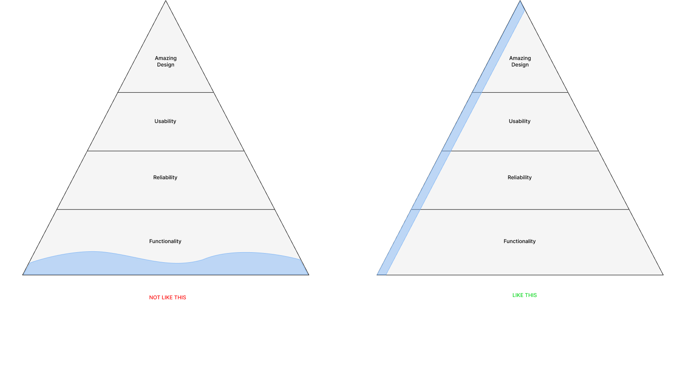

   It is quite common nowadays, to hear about doing an MVP when you're in the wonderful world of product or in a startup. Used as a key word to say "we want to go live asap" it is usually badly used or worst : badly done. As everyone was using the MVP words, we came with new fancy accronym : MLP, MMP, RAT, SLC ... 

## What are we talking about
MVP is the idea that you should build the smallest amount of product that will provide enough values for your identified user. It's only __then__  that you can add more and more features. 
<q>“If you are not embarrassed by your first product, you launched too late.” <small>Reid Hoffman</small></q>
Pro MVP are saying that building the smallest amount will help you find out what features your users really want, and assuring that you're building only the right ones. Anti-MVP will tell us that a MVP is just an unfinished product that no one will love and that will stay in this state forever. 

As a reminder, MVP is usually about this : 
* __Learning__ : You're here to validate ideas : What are we trying to learn?
* __Iterate__ : You're MVP will evolve fastly after each learnings
* __Viable__ : Why is everyone forgetting that the V in MVP is viable. It is nice to be fast, but if it's crap ...
* __Minimum__ : One of the hardest part, you have to come with the least number of features in order to stay reliable. 

MVP is built on a serie of iterations that we call "build-mesure-learn". 

As people weren't convince by the efficience of this 3 letters, they come with a lot of fancy new accronyms such as : 

__MLP__ (Minimum Lovable Product) : The idea is to make your product instantly lovable by people, meaning you're playing on an emotional level. As opposed as the MVP your launching your most important features first, not the primoridial one. It's usually used when facing an already competiting environment. And it "usually" comes after your mvp. 

__RAT__ (Riskiest Assumption Test) : Test directly your most dangerous assumption. Once again it's about build, mesure and learn but more in this order : 
* Learn
* Mesure
* Build fast

__SLC__ (Simple, Lovable, Complete) : This one's more subtle. It's like an MVP but with a strong emphazes on "Simple" opposed as minimum. The minimum variable is oftenly seen as " we want to ship at this date, what do we cut, what features won't make it". Simple is more about, this features are nice, but can we simplify them. The great thing about Simplicity, is that it can be part of the conversation from the very beginning.

__MMP__ (Minimum marketable product) : To be simple, it's an MVP with more than one iteration. An MVP without the shame of it. 

## The MVP of your RAT is an MLP and a SLC

Long story short, all of this new accronyms only exist because MVP suffers from its celebrity. MVP is used so much it’s lost its original meaning. It's mistakenly applied to refer to the first release of a *rudimentary* product. As a result, the term MVP has ended up becoming much more complex than the quick test it was supposed to be and far too badly done for a released product. 
I'm not saying there's no differences between all of this _method_ i'm just saying that : YES we need to start small somewhere before going full release. It's about gathering information, test assumptions, test adoption etc ... 

So, instead of searching for the MVP vs SLC vs RAT vs MLP winner, focus on building a great MVP by following the right path. And by right path, it does not mean by taking shortcuts, but by taking consideration of what is indispensable to make at this point and what should be left for later. MVP is a collection of features necessary to create value for customers. And doing that demand a HUGE effort, which is definitely not below-average.

## So? What features should I put in my first release?

__This__, is the fundamental question you should spend time on. There're 3 things that make this question hard to answer : 
* We don't know what features our users will love until they get their hand on the actual product (🙀)
* Users want everything, NOW !! 
* MVP is not something you're doing quite often (a.k.a We kind of suck by not having enough experiences)

Then you got other outside element making your mvp more difficult to define : 
* Competitors
* Money
* Time 

To give echo to my previous article ([It is not about the solution](https://www.julien-brionne.fr/posts/it-is-not-about-the-solution/)), in order to know what features you want to put in your MVP. 
You have to be sure on :
* What problem do you want to solve?
* Who is having the problem? 
* How big is the problem? 
* Your value statement (Uniquement value proposition) (What is YOUR answer on THIS problem?)

And more than everything you must know __what your CORE product is__.

It is really important to understand and know what is your CORE product. By doing a must-have / nice to have or any tool you prefer to prioritize features, you should keep focus on your CORE material, only what brings value to the users by solving their problem. 
Be careful with this "core" logic. It doesn"t mean your feature must be stripped-down, you have to keep in mind that every selected features must be complete, viable and with a great UX. Be careful with the "minimal" in MVP. 
In order to be a *must have* feature, it should be a feature that, if not done, could destroy the journey of an user. 

<figure class="extent">
    
    <figcaption>You do MVP like this</figcaption>
</figure>

## Don't forget the learning part! 

You're here to get feedbacks from your customer, so when setting what features should go in the MVP, you should also prepare an analysis plan on what you want to track, what KPIs you're following to know if you're going in the right direction or not. It could be as simple as a landing page of your upcoming product and you just measure the number of leads. 

