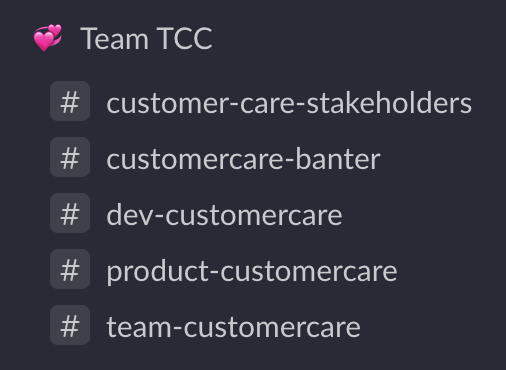
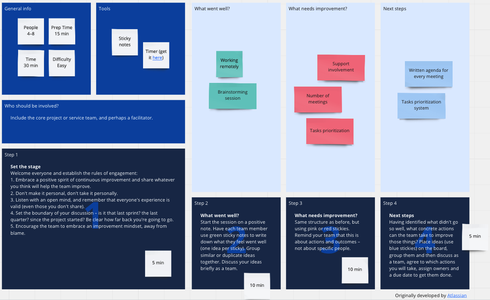

<a href="https://heetch.com/" title="Heetch - VTC">Heetch</a> has always been a remote-friendly company, even before the crisis situation I was working with a fully distributed team. Now that Covid-19 has forced a lot of persons to work from home, it's time to share a little how we succeed in working remotely. 

<figure class="extent">
    
    <figcaption>Video Call</figcaption>
</figure>

As the product manager of the customer care team which owns the internal platform, builds the B2B offer and manage the customer care domain (I should talk about [DDD](https://en.wikipedia.org/wiki/Domain-driven_design) one day), I'm facing a lot of issues, talking to a lot of stakeholders, synchronizing with all my peers, following multiple features development. If we were not organized, I'd be drowning under pressure, stress and would be close to burnout. 
Good news for me, I'm not because, we've succeeded as a team to find our organisations and how to balance the nice rhythm of synchrone VS asynchrone. 

Let's talk about **remote work**. 
*NB : This is written in the state of the 14th of October, we're trying to adjust, adapt and evolve continuously our processes*

# What do we need to be efficient

## Strong team trust 💪
Looks pretty obvious but it's one of the hardest challenge to conquer. Usually when going remote, what can happen is the too recurrent question : Do people work less now they're home ? The worst result is falling into micro-management for a manager and overcompensate by working too much for employees. The final result is always the same for both : Burnout.

<q>The land of burnout is not a place I ever want to go back to. <cite class="small">A.Huffington</cite>
</q>

Trust is something really hard to acquire, if you're the type of person to prefer doing something by himself to be sure it is well done, I'm not gonna lie ... it'll be hard. If you're the kind of manager who thinks his reps won't work when at home well it'll be hard too ...
**So how to bring trust in remote team ?**

### Transparency
In our team, there's no bad or good news, there's only news. With distance it is REALLY easy to withhold an information or not provide context enough for your teammates. At Buffer, they've put transparency as their first [value](https://buffer.com/about#values) : 
* As individuals, we view transparency as a lifestyle of authenticity and honesty.
* As a team, we view transparency as an effective way to work remotely and establish a culture of trust.
* As a company, we view transparency as a tool to help others.
* We share early in the decision process to avoid “big revelations.”
* We strive to make all communication clear and avoid making assumptions.

So how does it translate on a day to day basics ? 

**Communication**
Slack is our first tool to communicate altogether and what's great is that, by definition Slack is a [transparent communication tool](https://slack.com/intl/en-fr/blog/transformation/a-modern-leaders-guide-to-organizational-transparency). Most of our channels are public and there's almost no noise at all in this kind of channels. If I take an example of my current Slack, here's the chans concerning only my team : 

Every channel has a **purpose** and **everyone** can follow / interact in the channel. A **topic** is defined for every room to be sure to avoid talking in the wrong place. Even when we need the answer of one person in particular, we don't ask directly in direct message. With this way of functionning, we don't receive mail from the intern and everyone can be aware of anything he wants. I'll talk more about communication below. 

**Meeting notes & Documentations**
We're using [notion](https://notion.so) to write down every information needed for the whole company. From company values to technical specs to "How to". **Everything is written down** and accessible for everyone. It means, even our meeting notes of One on One are public. 

<figure class="extent">
    
    <figcaption>Taking notes</figcaption>
</figure>

**Feedbacks**
Feedbacks are really important to enhance the trust of our team, everyone has the right to say anything he wants without being judged. It's the best way to face all the challenges we want to accomplish, and it's the safest way to continuously improve.
We're doing our retrospectives in Retrium or Miro

<figure class="extent">
    
    <figcaption><a href="https://miro.com/miroverse/category/meetings/atlassian-team-plays-retrospective/">Retrospective Example</a></figcaption>
</figure>

### Consistency
We are quite predictable and consistent. We work with workflows, process and protocols and we tend to respect them everytime. It concerns every member of the team whatever the skills.

### Confidence
We're in the team for a reason, for a competence, for an experience and for a personality and we're here for a common goal : have impact for the team and the company. We trust each other through the confidence we have for every team members. 

### Accountability
Everyone is delivering what they are attending to deliver. No one want to carry the team or a task because another member is not playing the game.

### Commitment
We need to be commited to meeting deadlines, we need to accomplish the goals we've setted to ourself our by our leaders.

## Setting clear expectations
You can't work in a proper way with a remote team if you don't what is expected from you. And i'm not talking just about "what is my mission exactly ?". I'm talking about being clear on every aspects awaited by / from you on your team. Just saying is NOT enough.

<figure class="extent">
    
    <figcaption>Communication</figcaption>
</figure>

### Communication 
As my colleagues are not just behind / next to me, to avoid communication to fall through the cracks, we had to set expectations from the start : 
* What do we use to communicate
* How often ?
* Is it in the calendar as a placeholder or is it mandatory ?
* When can you mention someone
* When are you doing a meeting instead of a long Slack message ... 

### Work hours
Some people in the team have kids and prefer starting early in the morning then having a break to get the kid to the kindergarten, some are more interested by working late hours. So we need to give answers for this kind of questions : 

* Are we each expected to be online and available to each other during specific hours? 
* Is it necessary to signify when we’re offline for a certain period of time? 
* If so, will we do this through any specific method (ex: a calendar block)?

At Heetch, except for the care team, we don't really "count" hours we're doing. We're more **focused on outcome than hours**. 
To be fair, if you focus on hours, you'll get people coming on time and leaving late, but are they really productive? We prefer **setting clear goals and provide the means to achieve them**. In the end, we don't care how people are organizing their agenda as long as they deliver what we agreed on. 
So by empowering people with goals instead of tasks, they care more about the outcome.  

### Metrics and performance
We have a strong **result-oriented culture** and people's productivity is measured by their results. Every one has a common team goal + individual goal linked to their specificities. I set with the EM and the PD all the priority projects, how we'll measure the success, why it's a priority what the awaited output etc ...

### Career Path
Last but not least, expectations are not only based on the project you're working on, or the productivity you can provide. Your career path is at all time available and defines all the aspects you have to complete in order to progress in your level path. When you're lost on what's attented from you, you can always take a look at what you should do. 
This tool is also really great to know what you miss in order to increase your level, and it's the best tool to get a raise 🤑.  

## Over Communication (yes AGAIN)
As you should now understand, communications is one the most important point of an efficient remote team. But it's also one of the hardest key to master. 

Remote communication can mess up with the normal pace of a direct communication. Also it is important to remember that the kinds of nuanced communication you get in an office setting don't necessarly translate online. So you must set, once again, rules. 

### Async AND Sync
That's maybe one of the most important part of working remotely. You can't expect that the colleague you're sending a message is behind his computer waiting for your magnificient text. 
Nothing in your work must need an immediate answer. NOTHING. 
It's really hard to find the right balance between having a video call or just some written exchanges. 
Usually, everything about human exchange like 1 on 1 or team routine are done via Video Calls. 
But the preparation of every meeting is done by everyone asynchronously on a notion page.  
Now what's really important to understand is the impact of Asynchronous communication. 
Asynchronous communication makes it possible for people to respond and act on their own terms.
It allows for everyone to be proactive instead of reactive. 
You can focus on your work without being constantly interrupted.
It provides a chance to think twice—most people don’t make the best decisions when they are pressured to answer on the spot.
You can decide when to check your messages and when to respond to them. And that's a key changer when working remotely. 

<figure class="extent">
    
    <figcaption>Writing</figcaption>
</figure>

### Written communications are a bless 
We do use a lot of written communications in order to provide status, to present a case, to ask for an answer and so on. 
Being behind a screen can create opportunities for the team members less inclined to speak out publicly. When you're writting, you place less importance on interpersonal skills and physical appearance and it offers an efficient way to share power and decision. 
It is proven than introverted people are less inhibited in online interactions. 

Now, be careful, writting communication is not something that easy to do. We're looking for clear communications and not brief communications. It's sometimes better to write less often but with more impacts. Being clear means, exposing the context (don't assume people understand your understandings), defining the meaning of the communication, what your are waiting for after this message etc... 
Be careful also with the virtual unconscious bias, where punctuation, grammar and word choice might reveal prejudiced attitudes towards certain groups.

Finally, to have a good written communication, you also need to set some standards. For example, we're using a lot of emoji to help understand what's the meaning of our communication, or to invite people to speak out on what they think of your communication. 

### Don't spam
Over communication doesn't mean communicating everytime on everything. You don't have to follow up a slack message with a mail and a phone call. Every medium used create different demands on the time of the receiver. Choose wisely ! 

## Rituals

Just to provide a small context, our team is composed of :
* 1 product manager
* 1 product designer
* 1 engineering manager
* 1 data scientist
* 3 front end developers
* 3 backend developers
* 2 mobile developers

So it makes a lot of people, and all this small world should be able to work in the most autonomous way and whenever they want in the condition they want.

<figure class="full-width">
    
    <figcaption>Work from anywhere you want</figcaption>
</figure>

### Delivery weekly meeting
<dl>
    <dt>Time</dt>
    <dd> 1 hour once a week on tuesday</dd>
    <dt>Objective</dt> 
    <dd>Align the team on everything they have to know, from next quarter objectives, next big move in the company, measures, feedback. It's the meeting where everyone has the opportunity to demo his current work to everyone. Init the sprint</dd>
    <dt>Attendees</dt>
    <dd>All the team is in it</dd>
    <dt>What's the structure ?</dt>
    <dd>
        <ul>
            <li>Talk about the news</li>
            <li>outages or big error</li>
            <li>Team status</li>
            <li>Support Leader</li>
            <li>Focus of the week (Delivery and Discovery)</li>
            <li>Monitoring</li>
            <li>Decisions and CTA</li>
            <li>Open Topics</li>
        </ul>
    </dd>
    <dt>Tool used</dt> <dd>Notion with a nice template. The script changes every weeks.</dd>
</dl>

If we had to keep only one it would be this one. It's where everything important is share, where everything is shown.  

### Project Touchpoint
<dl>
    <dt>Time</dt>
    <dd>20 minutes once a week per project (usually 2)</dd>
    <dt>Objective</dt>
    <dd>Small point for the follow-up. What's the status of the loaded task in the sprint, what is blocking and what are the action plan</dd>
    <dt>Attendees</dt>
    <dd>People in the project</dd>
    <dt>What's the structure</dt>
    <dd>Usually done by the lead dev of the project, list all the current tasks in details (based on the user stories) and list all the subject we'll have to discuss</dd>
    <dt>Tool used : Jira & Notion</dt>
</dl>

Touchpoints are just a quick way to exchange on an ongoing project, listing call to actions etc ...

### Retropective
<dl>
    <dt>Time</dt>
    <dd>30 minutes on friday at the end of the sprint</dd>
    <dt>Objective</dt>
    <dd>Debrief on what went well, what was painful and how to continuously progress, evolve ...</dd>
    <dt>Attendees</dt>
    <dd>All the team</dd>
    <dt>What's the structure</dt>
    <dd>We're doing it asynchronously. With a Mad / Sad / Glad format on Miro, everyone had post-it, everyone comment on post and try to find call to actions. When we see each other we talked about voted and commented post it and talk about the action points. </dd>
    <dt>Tool used : Miro</dt>
</dl>

## Don't forget to chill 
That's not because you don't "see" your colleague that you can't have break time with them. For example we have another ceremonial I haven't listed above that we call the "banter". 
It's at the end of the week and it's a great moment with everyone who can / want to attend to talk about everything but work. We usually drink a bear, play a game (Skribbble for example) and talk about silly things. 
We also usually do some small coffee chat break whenever the need. 

## Conclusion
From a force position due to the covid-19 crisis, I'm now enjoying a lot being full remote as I have found an equilibre between perso and pro life and I've never been so beamed about my professional situation. I hope what I've shared will help you a little with your potential current situation.  
